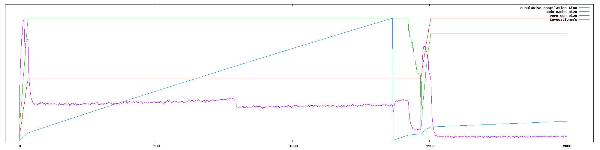
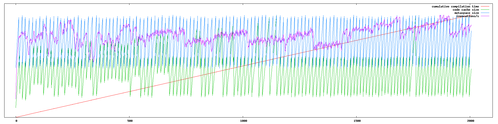

Building
========

Make sure you have java 7 and maven 3 installed and run:

    mvn install

Running
=======

Run with java 7 to reproduce the problem:

    java -XX:ReservedCodeCacheSize=20m -XX:InitialCodeCacheSize=20m -jar target/jittest-1.0-SNAPSHOT-standalone.jar

Results
=======

Here are the results from a sample run with 7u40 ([stats-7u40.txt](stats-7u40.txt)).

For contrast, here's the output with 1.8.0-ea-b100 ([stats-8.txt](stats-8.txt)), which doesn't exhibit the issue. Keep in mind that the y axes are scaled differently, so don't try to compare the charts directly.

